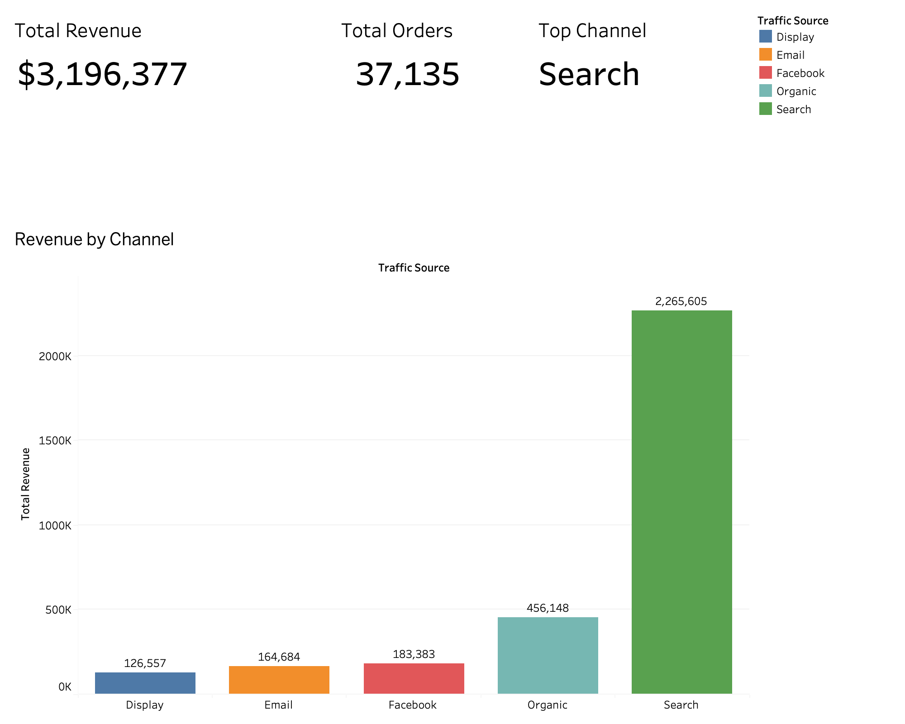
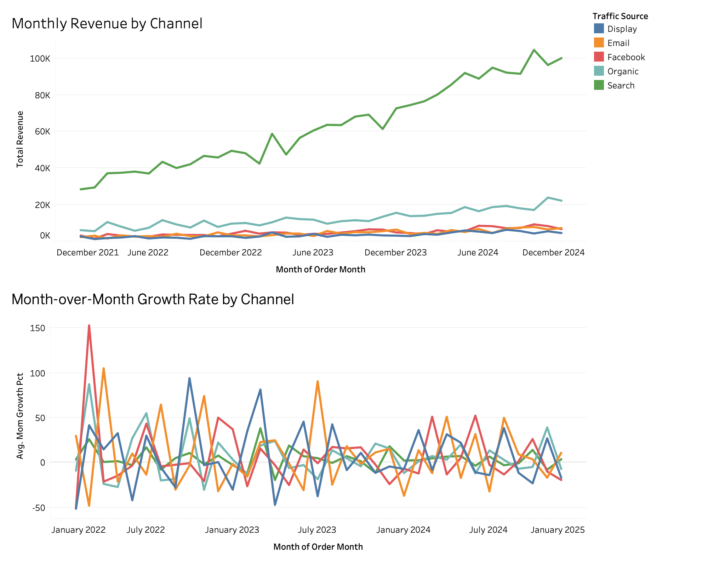

# E-Commerce Channel Performance Analysis

## Overview
Analyzed 3 years of e-commerce transaction data (2022–2024) using BigQuery SQL and Tableau 
to identify which marketing channels drive the most revenue and how channel performance 
evolves over time — enabling data-driven budget allocation decisions.

## Tools & Skills
- **SQL**: BigQuery (CTEs, Window Functions — LAG, RANK, DATE_TRUNC)
- **Visualization**: Tableau Public
- **Data Source**: Google Cloud Public Dataset — `thelook_ecommerce`

## How SQL Was Used
- Built a **CTE** to aggregate monthly revenue, orders, and unique customers by traffic source
- Used **LAG()** window function to calculate month-over-month (MoM) revenue growth per channel
- Used **RANK()** window function to rank channels by revenue within each month
- Joined 3 tables (orders, order_items, users) to connect traffic source data with sales data

## Key Findings
- **Search dominates**: Search channel accounted for 71% of total revenue ($2.27M out of $3.2M) and showed consistent YoY growth
- **Organic is growing**: Organic traffic ranked 2nd ($456K) and showed an upward trend without paid spend
- **Paid channels underperform**: Display, Email, and Facebook combined ($474K) performed similarly to Organic despite incurring costs
- **Channel rankings were stable**: Search and Organic held #1 and #2 consistently across all 36 months

## Recommendations
1. **Double down on SEO**: Search is the top revenue driver with consistent growth — invest in content and SEO to sustain momentum
2. **Re-evaluate paid channel ROI**: Paid channels (Display, Email, Facebook) generate similar revenue to free Organic traffic — audit cost efficiency and reallocate budget to higher-performing channels
3. **Scale Organic**: Organic traffic is growing without paid spend — social and content marketing investment could accelerate this channel further

